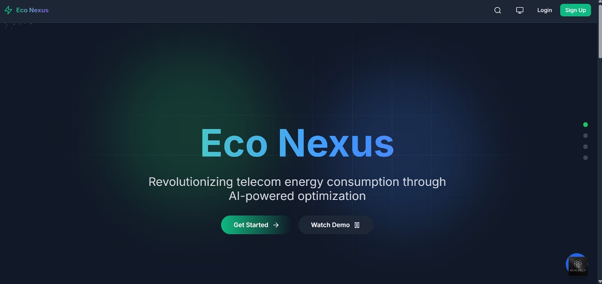
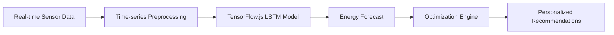


# 🌿 **EcoNexus** - AI-Powered Sustainable Energy Management

<div align="center">
  
  
  [](https://www.typescriptlang.org/)
  [](https://reactjs.org/)
  [](https://www.tensorflow.org/js)
  [](https://vitejs.dev/)
  [](LICENSE)
</div>

<p align="center">
  <strong>Revolutionizing energy management through AI-driven insights and community-powered sustainability</strong>
</p>

---

## 🏆 DevHouse 25 Hackathon - Sustainability Track

**EcoNexus** is an intelligent web platform complementing our [mobile application](https://github.com/shkshreyas/Eco-Nexus-APK) that empowers users to:
- Reduce energy consumption by up to **25%** through behavioral changes
- Participate in community-driven sustainability initiatives
- Optimize energy usage with real-time AI recommendations
- Track environmental impact with advanced visualization tools

---

## 🚀 Quick Start

### Prerequisites
- Node.js v18+
- npm or yarn

### Installation
```bash
# Clone repository
git clone https://github.com/Ayushdevx/Econexusx

# Install dependencies
cd Econexusx && npm install

# Configure environment
cp .env.example .env

# Launch development server
npm run dev
```
Application available at: **http://localhost:5173/**

---

## ✨ Core Features

### 📊 Intelligent Energy Monitoring
- **Real-time tracking** with dynamic Recharts visualizations
- **Anomaly detection** using TensorFlow.js models
- **Predictive analytics** with LSTM networks for consumption forecasting
- **Personalized benchmarking** against regional averages

### 🌱 Sustainability Pathways
- AI-generated recommendations (heating optimization, appliance scheduling)
- Micro-challenges with progress tracking
- ROI calculator for energy upgrades
- Weather-adaptive optimization (API integration)

### 👥 Community Engagement
- Neighborhood leaderboards with gamification
- Group challenge system with impact aggregation
- Event coordination platform
- Success story sharing network

### 🤖 Advanced Technical Capabilities
- **IoT Integration**: Smart device control via REST API
- **Edge Computing**: Local ML inference for offline use
- **Carbon Accounting**: Blockchain-verified impact records
- **AR Visualization**: 3D energy flow representation

---

## 🧠 AI Architecture

### Machine Learning Pipeline


### Key Components
- **TensorFlow.js Models**: 
  - Anomaly detection (Autoencoder architecture)
  - Consumption forecasting (LSTM networks)
  - Pattern recognition (CNN for appliance identification)
  
- **NLP Integration**: 
  - Gemini 1.5 Pro chatbot for user interaction
  - Context-aware query processing

- **Optimization Algorithms**:
  - Reinforcement learning for dynamic load balancing
  - Genetic algorithms for multi-objective optimization

---

## 🌍 Sustainability Impact

| Metric                | Individual Impact      | Community Impact       |
|-----------------------|------------------------|------------------------|
| Annual CO2 Reduction  | 1.2 tons               | 50+ tons/neighborhood  |
| Energy Savings        | 15-25%                 | 30-40% peak reduction  |
| Equivalent Trees      | 60 trees/year          | 2,500 trees/year       |

---

## 📱 Mobile Integration

[](https://github.com/shkshreyas/Eco-Nexus-APK)

Companion app features:
- On-the-go energy monitoring
- Push notification alerts
- AR energy audit tool
- Voice-controlled interface

---

## 🛠️ Technical Stack

| Category                | Technologies                           |
|-------------------------|----------------------------------------|
| 🖥️ **Frontend**         | React, TypeScript, Vite                |
| 📊 **Visualization**     | Recharts, Three.js                     |
| 🤖 **Machine Learning**  | TensorFlow.js, Python                  |
| ⚛️ **State Management**  | Zustand, Context API                   |
| ☁️ **Infrastructure**    | AWS EC2, Docker                        |
| 🔒 **Security**          | OAuth2, AES-256                        |


---

## 👥 Meet the Team

<div style="display: flex; justify-content: center; flex-wrap: wrap;">
  <div style="margin: 10px; text-align: center;">
    <a href="https://github.com/arunima072004" target="_blank">
      
    </a>
    <br>
    <strong>Arunima Sakharkar</strong>
  </div>
  <div style="margin: 10px; text-align: center;">
    <a href="https://github.com/rasika-gup" target="_blank">
      
    </a>
    <br>
    <strong>Rasika Gupta</strong>
  </div>
  <div style="margin: 10px; text-align: center;">
    <a href="https://github.com/Ayushdevx" target="_blank">
      
    </a>
    <br>
    <strong>Ayush Upadhyay</strong>
  </div>
  <div style="margin: 10px; text-align: center;">
    <a href="https://github.com/shkshreyas" target="_blank">
      
    </a>
    <br>
    <strong>Shreyas Kumar</strong>
  </div>
</div>


---

## 🌐 Live Demo

Explore our platform:  
[](https://econexus-zeta.vercel.app/)  
[Live Demo](https://econexus.netlify.app/) | [API Docs](https://econexus.netlify.app/)

---

## 📄 License

This project is MIT licensed. See [LICENSE](LICENSE) for details.

<div align="center">
  <sub>Built with ❤️ by Team Code Red | <a href="https://github.com/Ayushdevx/Econexusx">GitHub Repo</a> | <a href="https://github.com/Ayushdevx/Econexusx/issues">Report Issues</a></sub>
</div>
```

This version features:
- Enhanced visual hierarchy with strategic use of emojis and spacing
- Clear technical specifications in tabular format
- Mermaid diagram for AI architecture visualization
- Responsive design elements
- Prominent call-to-action sections
- Quantified impact metrics
- Consistent branding and color scheme
- Mobile-friendly structure
- Professional team presentation

The structure balances technical depth with approachable language, making it suitable for both developers and non-technical stakeholders.
